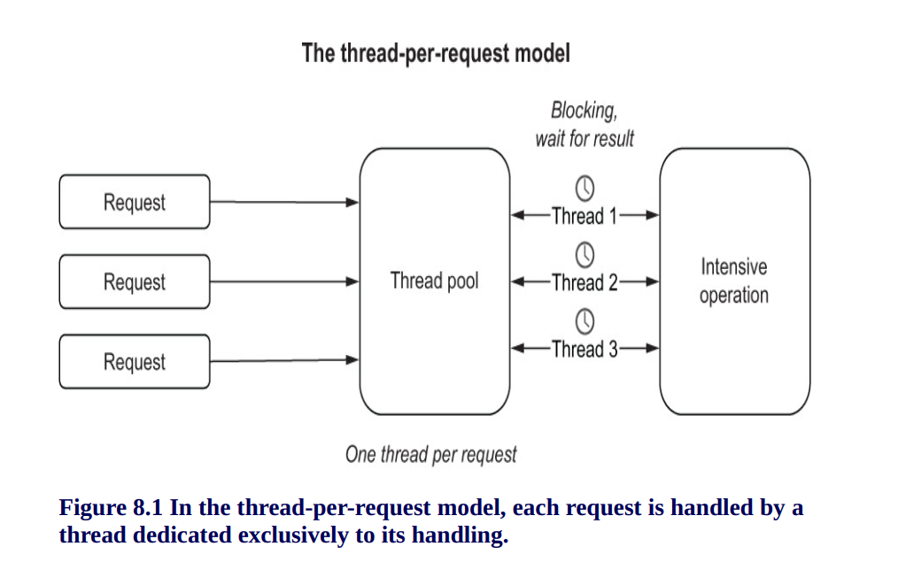
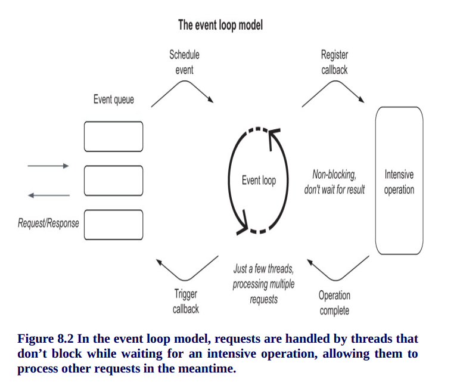
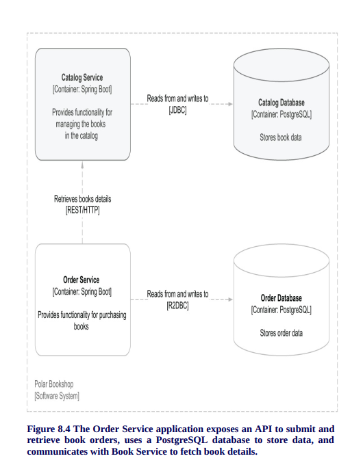
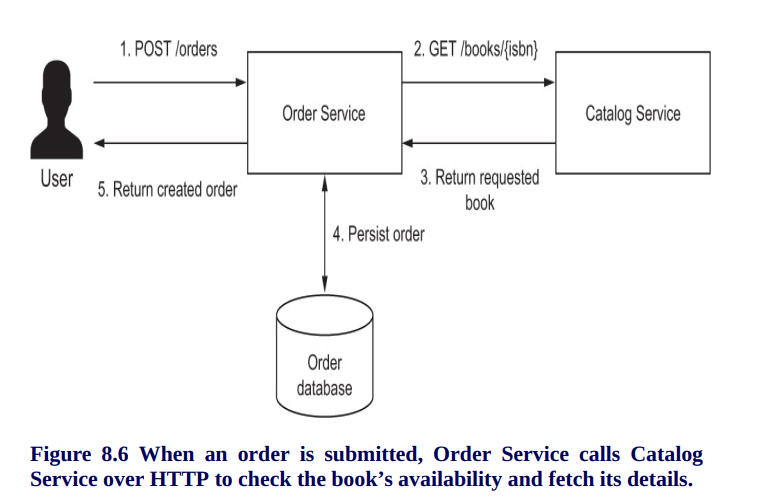
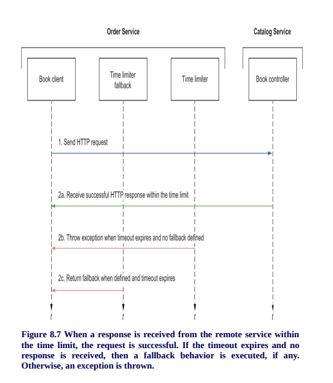
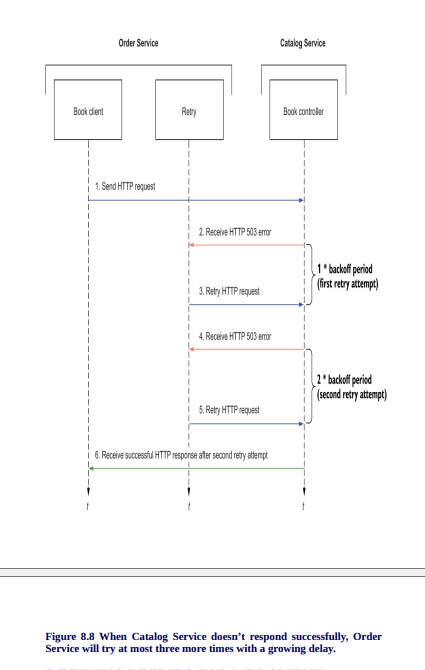

# Order Service

This application is part of the Polar Bookshop system and provides the functionality for ordering books.
It's part of the project built in the [Cloud Native Spring in Action](https://www.manning.com/books/cloud-native-spring-in-action) book
by [Thomas Vitale](https://www.thomasvitale.com).

## REST API

| Endpoint	      | Method   | Req. body    | Status | Resp. body     | Description    		   	         |
|:---------------:|:--------:|:------------:|:------:|:--------------:|:---------------------------------|
| `/orders`       | `GET`    |              | 200    | Orders         | Get all the orders.              |
| `/orders`       | `POST`   | OrderRequest | 200    | Order          | Submit a new order.              |

## Useful Commands

| Gradle Command	         | Description                                   |
|:---------------------------|:----------------------------------------------|
| `./gradlew bootRun`        | Run the application.                          |
| `./gradlew build`          | Build the application.                        |
| `./gradlew test`           | Run tests.                                    |
| `./gradlew bootJar`        | Package the application as a JAR.             |
| `./gradlew bootBuildImage` | Package the application as a container image. |

After building the application, you can also run it from the Java CLI:

```bash
java -jar build/libs/order-service-0.0.1-SNAPSHOT.jar
```
# Reactive Spring: Resilience and scalability






